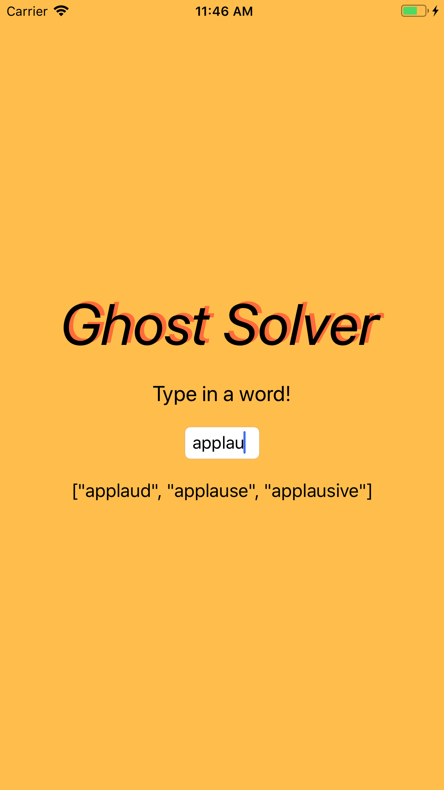

# Ghost Solver Swift App

I made an ios app using swift to solve a game my family would play during car rides as a kid called Ghost. In the game, you take turns saying letters to form a word. However, you don't want to finish a word that has more than 3 letters. So for example, going in a circle, the letters could be 'a' - 'p' - 'p' - 'l', and the next person wouldn't want to say 'e' to finish 'apple', so instead could say something like 'a' which could make 'applaud'. If you finish a word you get an 'out' and people can challenge your letters if they don't believe a word exists.

As you type in the text field, the app will show possible words that can still be finished:

---

I learned about swift syntax and the general work flow for creating the UI and linking it to the controller via delegate functions. I had a fair amount of trouble getting the 'on edit' event to work for the text field to update the output as you type, but eventually got it working.

As you can see, the UI isn't the prettiest but I was more focused on getting the swift syntax down and the controller working. Although there were several parts that took longer than others, there wasn't anything specific I wanted to include but didn't work.
